# GP2040 Usage

Select the button labels to be displayed in the usage guide: <label-selector></label-selector>

## Buttons

GP2040 uses a generic button labeling for gamepad state, which is then converted to the appropriate input type before sending. This table provides a map of GP2040 buttons to the supported input types and layouts:

| GP2040  | XInput | Switch  | PS3          | DirectInput  | Arcade |
| ------- | ------ | ------- | ------------ | ------------ | ------ |
| B1      | A      | B       | Cross        | 2            | K1     |
| B2      | B      | A       | Circle       | 3            | K2     |
| B3      | X      | Y       | Square       | 1            | P1     |
| B4      | Y      | X       | Triangle     | 4            | P2     |
| L1      | LB     | L       | L1           | 5            | P4     |
| R1      | RB     | R       | R1           | 6            | P3     |
| L2      | LT     | ZL      | L2           | 7            | K4     |
| R2      | RT     | ZR      | R2           | 8            | K3     |
| S1      | Back   | Minus   | Select       | 9            | Coin   |
| S2      | Start  | Plus    | Start        | 10           | Start  |
| L3      | LS     | LS      | L3           | 11           | LS     |
| R3      | RS     | RS      | R3           | 12           | RS     |
| A1      | Guide  | Home    | -            | 13           | -      |
| A2      | -      | Capture | -            | 14           | -      |

If you do not have a dedicated Home button, you can activate it via the <hotkey v-bind:buttons='["S1", "S2", "Up"]'></hotkey> button combination.

## Input Modes

To change the input mode, **hold one of the following buttons as the controller is plugged in:**

* <hotkey v-bind:buttons='["B1"]'></hotkey> for Nintendo Switch
* <hotkey v-bind:buttons='["B2"]'></hotkey> for XInput
* <hotkey v-bind:buttons='["B3"]'></hotkey> for DirectInput/PS3

Input mode is saved across power cycles.

## D-Pad Modes

You can switch between the 3 modes for the D-Pad **while the controller is in use by pressing one of the following combinations:**

* <hotkey v-bind:buttons='["S1", "S2", "Down"]'></hotkey> - D-Pad
* <hotkey v-bind:buttons='["S1", "S2", "Left"]'></hotkey> - Emulate Left Analog stick
* <hotkey v-bind:buttons='["S1", "S2", "Right"]'></hotkey> - Emulate Right Analog stick

D-Pad mode is saved across power cycles.

## SOCD Modes

Simultaneous Opposite Cardinal Direction (SOCD) cleaning will ensure the controller doesn't send invalid directional inputs to the computer/console, like Left + Right at the same time. There are 3 modes to choose from **while the controller is in use by pressing one of the following combinations:**

* <hotkey v-bind:buttons='["S2", "A1", "Up"]'></hotkey> - **Up Priority mode**: Up + Down = Up, Left + Right = Neutral (Hitbox behavior)
* <hotkey v-bind:buttons='["S2", "A1", "Down"]'></hotkey> - **Neutral mode**: Up + Down = Neutral, Left + Right = Neutral
* <hotkey v-bind:buttons='["S2", "A1", "Left"]'></hotkey> - **Last Input Priority (Last Win)**: Hold Up then hold Down = Down, then release and re-press Up = Up. Applies to both axes.

SOCD mode is saved across power cycles.

## RGB LEDs

> LED modes are available on the Pico Fighting Board, Crush Counter/OSFRD and custom builds only.

### RGB LED Animations

The following animations are available:

| Name | Description | LED Parameter |
| - | - | - |
| Off | Turn off per-button RGB LEDs | - |
| Static Color | Sets all LEDs to the same color | Cycle through colors: *Red*, *Orange*, *Yellow*, *Lime Green*, *Green*, *Seafoam*, *Aqua*, *Sky Blue*, *Blue*, *Purple*, *Pink*, *Magenta* |
| Rainbow Cycle | All LEDs cycle through the color wheel displaying the same color | Adjust animation speed |
| Rainbow Chase | A fading, rainbow cycling lines travels across the LED chain | Adjust animation speed |
| Static Theme | Set the LEDs to a pre-defined static theme | Cycle through themes, see [RGB LED Static Themes](#rgb-led-static-themes) for details. |

### RGB LED Hotkeys

| Hotkey | Description |
| - | - |
| <hotkey v-bind:buttons='["S1", "S2", "B3"]'></hotkey> | Next Animation |
| <hotkey v-bind:buttons='["S1", "S2", "B1"]'></hotkey> | Previous Animation |
| <hotkey v-bind:buttons='["S1", "S2", "B4"]'></hotkey> | Brightness Up |
| <hotkey v-bind:buttons='["S1", "S2", "B2"]'></hotkey> | Brightness Down |
| <hotkey v-bind:buttons='["S1", "S2", "R1"]'></hotkey> | LED Parameter Up |
| <hotkey v-bind:buttons='["S1", "S2", "R2"]'></hotkey> | LED Parameter Down |
| <hotkey v-bind:buttons='["S1", "S2", "L1"]'></hotkey> | Pressed Parameter Up |
| <hotkey v-bind:buttons='["S1", "S2", "L2"]'></hotkey> | Pressed Parameter Down |

The `LED Parameter` hotkeys may affect color, speed or theme depending on the current RGB LED animation. The `Pressed Parameter` options will change the colors/effects for the on-press animations.

### RGB LED Static Themes

| Name | Preview |
| - | - |
| **Static Rainbow** | 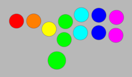 |
| **Xbox** | 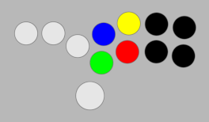 |
| **Xbox (All)** | 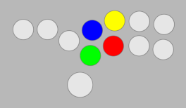 |
| **Super Famicom** | 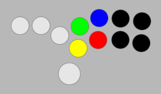 |
| **Super Famicom (All)** | 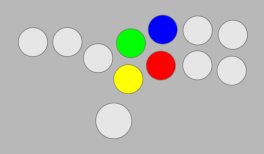 |
| **PlayStation** | 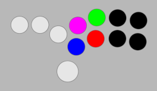 |
| **PlayStation (All)** | 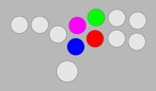 |
| **Neo Geo Straight** | 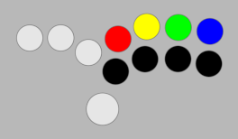 |
| **Neo Geo Curved** | 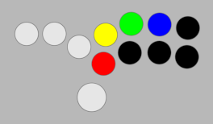 |
| **Neo Geo Modern** | 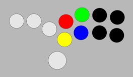 |
| **Six Button Fighter** | 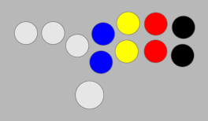 |
| **Six Button Fighter +** | 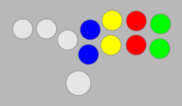 |
| **Street Fighter 2** | 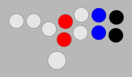 |
| **Guilty Gear Type-A** | 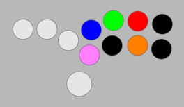 |
| **Guilty Gear Type-B** | 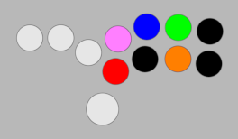 |
| **Guilty Gear Type-C** | 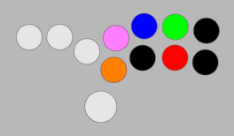 |
| **Guilty Gear Type-D** | 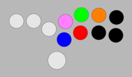 |
| **Guilty Gear Type-E** | 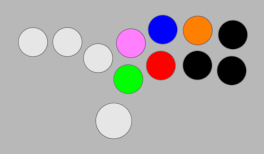 |
